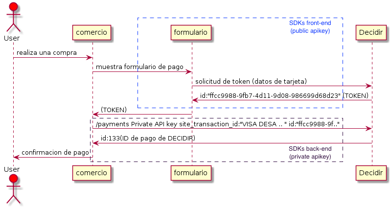
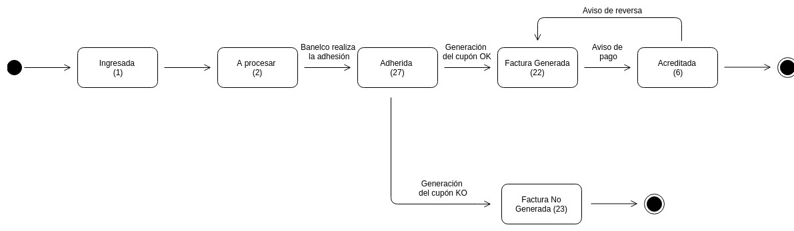
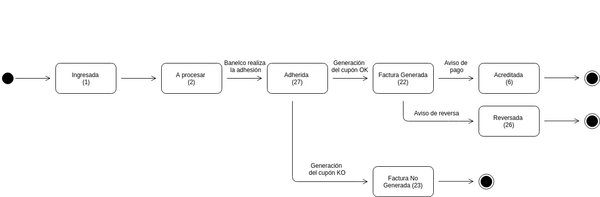

Decidir SDK NODEJS
===============

Modulo para conexión con gateway de pago DECIDIR2

## Índice
- [Introducción](#introduccion)
  - [Alcance](#Alcance)
  - [Diagrama de secuencia](#diagrama-de-secuencia)
- [Instalación](#instalacion)
  - [Versiones de NODEJS soportadas](#versiones)
  - [Manual de Integración](#manualintegracion)
  - [Ambiente](#ambiente)
- [Uso](#uso)
  - [Inicializar la clase correspondiente al conector](#initconector)
  - [Operatoria del Gateway](#operatoria)
    - [Pagos Offline](#pagos-offline)
    - [Health Check](#healthcheck)
    - [Ejecución del Pago](#payment)
    - [Operación en dos pasos](#twosteps)
    - [Comercios agregadores](#comercios-agregadores)
    - [Respuesta al pago](#respuesta-al-pago)
    - [Listado de Pagos](#getallpayments)
    - [Información de un Pago](#getpaymentinfo)
    - [Devoluciones de pagos](#refunds)
      - [Anulación / Devolución Total de Pago](#refund)
      - [Anulación de Devolución Total](#deleterefund)
      - [Devolución Parcial de un Pago](#partialrefund)
      - [Anulación de Devolución Parcial](#deletepartialrefund)
  - [Tokenización de tarjetas de crédito](#tokenizaciontarjeta)
    - [Listado de tarjetas tokenizadas](#listadotarjetastokenizadas)
    - [Solicitud de token de pago](#solicitudpagotokenizado)
    - [Ejecución de pago tokenizado](#pagotokenizado)
    - [Solicitud de token de pago con tokenización interna](#solicitud-de-token-de-pago-con-tokenizacion-interna)
    - [Ejecución de pago con tokenización interna](#ejecucion-de-pago-con-tokenizacion-interna)
    - [Eliminación de tarjeta tokenizada](#eliminartarjetatokenizada)
  - [Formulario de pago](#formpago)
  - [Integración con Cybersource](#cybersource)
    - [Parámetros Comunes](#parametros-comunes)
    - [Retail](#retail)
    - [Ticketing](#ticketing)
    - [Digital Goods](#digital-goods)
    - [Servicios](#services)
    - [Travel](#travel)
- [Tablas de referencia](#tablasreferencia)
  - [Códigos de Medios de Pago](#codigos-de-medios-de-pago)
    - [Divisas Aceptadas](#divisasa)
  - [Provincias](#provincias)

<a name="introduccion"></a>

## Introducción

### 🚀 Flujo de una Transacción con las SDKs

El flujo de una transacción a través de las **SDKs** consta de dos pasos clave:

1. **Generación de un Token de Pago** (por parte del cliente)
2. **Procesamiento del Pago** (por parte del comercio)

### 🌟 Funcionalidades Principales

Nuestras **SDKs** no solo facilitan la integración del proceso de pago, sino que también ofrecen un conjunto completo de herramientas para:

+ 🔗 **Crear links de pago** para ventas fáciles y rápidas.
+ 🔒 **Implementar 3D Secure (3DS)** para una autenticación más robusta.
+ 💳 **Realizar pagos con tarjetas tokenizadas** evitando almacenar datos sensibles.
+ 🔁 **Procesar devoluciones** de forma segura y eficiente.
+ 🛡️ **Aprovechar Cybersource** para garantizar la máxima seguridad en cada transacción.

### 📚 SDKs Disponibles

Ofrecemos SDKs específicas para diversos lenguajes de programación, permitiendo una integración sencilla y adaptable según tus necesidades.

---

+ [Sdk Java](https://github.com/decidir/SDK-JAVA.v2)
+ [Sdk PHP](https://github.com/decidir/SDK-PHP.v2)
+ [Sdk .Net](https://github.com/decidir/SDK-.NET.v2)
+ [Sdk Node](https://github.com/decidir/SDK-.NODE.v2)
---

### 🎯 Alcance

La **SDKs de Node** está diseñada para integrarse en aplicaciones móviles y web, permitiendo a los comercios:

+ ✅ **Realizar cobros** mediante múltiples métodos de pago, incluyendo tarjetas de crédito y débito, con soporte para transacciones en distintas monedas, como ARS y USD.
+ ✅ **Automatizar devoluciones** y cancelaciones de transacciones.
+ ✅ **Generar y gestionar links de pago** para ventas sin necesidad de integrar formularios complejos.
+ ✅ **Soportar autenticación reforzada** mediante 3D Secure (3DS).
+ ✅ **Implementar pagos con tarjetas tokenizadas**, protegiendo los datos sensibles de los clientes.

Este alcance cubre tanto soluciones para comercios que desean un proceso de pago simple como para aquellos que requieren flujos personalizados y mayor control sobre cada transacción.

[Volver al inicio](#alcance)

<a name="diagrama-secuencia"></a>

### 📈 Diagrama de Secuencia

El flujo de una transacción a través de las **SDKs** involucra dos pasos esenciales:

1. **Generar Token de Pago**: Se realiza una solicitud utilizando la **Llave de Acceso pública** (*public API Key*), enviando los datos sensibles de la tarjeta — como el PAN, mes y año de expiración, código de seguridad, titular, y tipo y número de documento —. A cambio, se recibe un **token de pago** que permitirá ejecutar la transacción.

2. **Pagar usando el Token de Pago**: Con la **Llave de Acceso privada** (*private API Key*), se procesa el pago enviando el **token generado** en el Paso 1, junto con el identificador de la transacción a nivel comercio, el monto total, la moneda y la cantidad de cuotas.

A continuación, se presenta un diagrama que ilustra el **Flujo de un Pago**.

</br>

[Volver al inicio](#diagramasecuencia)

<a name="instalacion"></a>

# Instalación del SDK

## Opción 1: Descarga directa

1. **Descargar la última versión del SDK**  
   Haz clic en el botón **Download ZIP** para obtener el SDK.  

   <br />  

2. **Incluir en el proyecto**  
   Descomprime el archivo descargado e incluye la carpeta del SDK en tu proyecto.

## Opción 2: Instalación mediante npm (Recomendada)

La instalación a través de npm es el método que recomendamos y hemos testeado exhaustivamente, asegurando una integración rápida y segura:

```bash
npm install sdk-node-payway
```

Asegúrate de que las dependencias estén definidas en tu archivo package.json, utilizando la versión más actual disponible:

```javascript
"dependencies": {
  "sdk-node-payway": "^1.0.0"
}
```

# ⚠️ **Requisitos del entorno**

> ⚠️ **El SDK solo es compatible con Node.js versión 18 o superior.**  ⚠️
<br />  

[Volver al inicio](#decidir-sdk-node)

<a name="versiones"></a>

## Versiones de NODEJS soportadas

> **La versión implementada del SDK está probada y es compatible con Node.js a partir de la versión 18.0.0 inclusive.**

[Volver al inicio](#versiones)

<a name="manualintegracion"></a>

## Manual de Integración

Se encuentra disponible la documentación **[Manual de Integración Decidir2](https://decidir.api-docs.io/1.0/guia-de-inicio/)** para su consulta online, en este detalla el proceso de integración. En el mismo se explican los servicios y operaciones disponibles, con ejemplos de requerimientos y respuestas, aquí sólo se ejemplificará la forma de llamar a los distintos servicios utilizando la presente SDK.

<a name="ambiente"></a>

## Ambientes

 ⚠️ El sdk NODEJS permite trabajar con los ambientes de Sandbox y Producción de Decidir. El ambiente se debe definir al instanciar el SDK.

```javascript

const ambient = "developer";//valores posibles: "developer" o "production";
const sdk = new sdkModulo.sdk(ambient, publicKey, privateKey, company, user);

```

[Volver al inicio](#ambiente)

<a name="uso"></a>

## Uso

<a name="initconector"></a>

### Inicializar la clase correspondiente al conector

El Sdk para NODEJS permite trabajar con los ambientes de desarrollo y de producción de Decidir.
El ambiente se debe instanciar como se indica a continuación.
Instanciación de la clase `sdk`

La misma recibe como parámetros la public key o private key provisto por Decidir para el comercio y el ambiente en que se trabajará.

```javascript

var publicKey = "b192e4cb99564b84bf5db5550112adea";
var privateKey = "566f2c897b5e4bfaa0ec2452f5d67f13";
var company = "Tienda-Margarita";
var user = "Cristian Arellano";
var ambient = "developer";//valores posibles: "developer" o "production";

const sdk = new sdkModulo.sdk(ambient, publicKey, privateKey, company, user);

```

[<sub>Volver a inicio</sub>](#decidir-sdk-nodejs)
<a name="operatoria"></a>

## Operatoria del Gateway

### Pagos Offline

Para el caso de la operatoria de pago offline, la operación requiere en un principio de la solicitud de un token a partir de datos del usuario.

Una vez generado y almacenado el token de Pago Offline, se deberá ejecutar la solicitud de pago utilizando el token previamente generado. Además del token de pago y los parámetros propios de la transacción, el comercio deberá identificar la compra con el site_transaction_id.

*Aclaracion*: amount es un campo double el cual debería tener solo dos dígitos decimales.

#### Pago Fácil

</br>

|Campo | Descripcion  | Oblig | Restricciones  |Ejemplo   |
| ------------ | ------------ | ------------ | ------------ | ------------ |
|site_transaction_id  |Identificador único para la operación |  SI| 8 dígitos | site_transaction_id: "170518_35"  |
|token  |Token generado en el primer paso |  SI|  36 dígitos,variable|  token: "03508514-1578-4140-ba02-6bdd65e2af95" |
|payment_method_id  | id del tipo de metodo de Pago Offline  |  SI|  Dos dígitos |  payment_method_id: "26"|
|amount  | Monto de la operación. 6 números enteros y 2 decimales  |  SI|  8 dígitos,variable |  amount: "11.00"|
|currency  | Son los días que existen entre el 1er y 2do vencimiento  |  SI|  3 letras |  currency: "ARS"|
|payment_type  | Tipo de pago  |  SI|  Letras |  payment_type: "single"|
|email  | email del usuario que esta haciendo uso del sitio  |Condicional   |Sin validacion   | email: "<user@mail.com>",  |
|invoice_expiration  | Fecha en que vence el cupón  |  SI|  Formato AAMMDD |  invoice_expiration: "191123"|
|cod_p3  | Son los dias que existen entre el 1º y 2º vencimiento de la factura. |  SI|  2,fijo ("00" si la factura tiene no tiene 2° vencimientos)|  invoice_expiration: "191123"|
|cod_p4  | Días después del 1º vencimiento y hasta que el cliente pueda abonar  |  SI|  3,fijo |  cod_p4: "123"|
|client  | Codigo Cliente  |  SI|   8,fijo |  client: "12345678"|
|surcharge  | Recargo por vencimiento del plazo  |  SI|  7,variable (5 digitos enteros y 2 decimales)|  surcharge: "10.01"|
|payment_mode  | Tipo de metodo de pago  |  SI|  Strin "offline" |  payment_mode: "offline"|

##### Ejemplo

```javascript
data = {
  site_transaction_id : "230518_41",
  token: '92a95793-3321-447c-8795-8aeb8a8ac067',
  payment_method_id: 25,
  amount: 10.00,
  currency: 'ARS',
  payment_type: 'single',
  email: 'user@mail.com',
  invoice_expiration : 191123,
  cod_p3: 12,
  cod_p4: 134,
  client: 12345678,
  surcharge: 10.01,
  payment_mode: 'offline'
};


```

[<sub>Volver a inicio</sub>](#decidir-sdk-nodejs)

#### Rapipago

</br>

|Campo | Descripcion  | Oblig | Restricciones  |Ejemplo   |
| ------------ | ------------ | ------------ | ------------ | ------------ |
|site_transaction_id  |Identificador único para la operación |  SI| 8 dígitos | site_transaction_id: "170518_35"  |
|token  |Token generado en el primer paso |  SI|  36 dígitos,variable|  token: "03508514-1578-4140-ba02-6bdd65e2af95" |
|payment_method_id  | id del tipo de metodo de Pago Offline  |  SI|  Dos dígitos |  payment_method_id: "26"|
|amount  | Monto de la operación. 6 números enteros y 2 decimales  |  SI|  8 dígitos,variable |  amount: "11.00"|
|currency  | Son los días que existen entre el 1er y 2do vencimiento  |  SI|  3 letras |  currency: "ARS" o "USD"|
|payment_type  | Tipo de pago  |  SI|  Letras |  payment_type: "single"|
|email  | email del usuario que esta haciendo uso del sitio  |Condicional   |Sin validacion   | email: "<user@mail.com>",  |
|invoice_expiration  | Fecha en que vence el cupón  |  SI|  Formato AAMMDD |  invoice_expiration: "191123"|
|cod_p3  | Son los dias que existen entre el 1º y 2º vencimiento de la factura. |  SI|  2,fijo ("00" si la factura tiene no tiene 2° vencimientos)|  invoice_expiration: "191123"|
|cod_p4  | Días después del 1º vencimiento y hasta que el cliente pueda abonar  |  SI|  3,fijo |  cod_p4: "123"|
|client  | Codigo Cliente  |  SI|   8,fijo |  client: "12345678"|
|surcharge  | Recargo por vencimiento del plazo  |  SI|  7,variable (5 digitos enteros y 2 decimales)|  surcharge: "10.01"|
|payment_mode  | Tipo de metodo de pago  |  SI|  Strin "offline" |  payment_mode: "offline"|

##### Ejemplo

```javascript

const data = {
  site_transaction_id: "230518_38",
  token: "8e190c82-6a63-467e-8a09-9e8fa2ab6215",
  payment_method_id: 26,
  amount: 10.00,
  currency: "ARS",
  payment_type: "single",
  email: "user@mail.com",
  invoice_expiration: "191123",
  cod_p3: "12",
  cod_p4: "134",
  client: "12345678",
  surcharge: 10.01,
  payment_mode: "offline"
};

```

#### Pago mis Cuentas

</br>

|Campo | Descripcion  | Oblig | Restricciones  |Ejemplo   |
| ------------ | ------------ | ------------ | ------------ | ------------ |
|site_transaction_id  |Identificador único para la operación |  SI| 8 dígitos | site_transaction_id: "170518_35"  |
|token  |Token generado en el primer paso |  SI|  36 dígitos,variable|  token: "03508514-1578-4140-ba02-6bdd65e2af95" |
|payment_method_id  | id del tipo de metodo de Pago Offline  |  SI|  Dos dígitos |  payment_method_id: "26"|
|amount  | Monto de la operación. 6 números enteros y 2 decimales  |  SI|  8 dígitos,variable |  amount: "11.00"|
|currency  | Son los días que existen entre el 1er y 2do vencimiento  |  SI|  3 letras |  currency: "ARS" o "USD"|
|payment_type  | Tipo de pago  |  SI|  Letras |  payment_type: "single"|
|email  | email del usuario que esta haciendo uso del sitio  |Condicional   |Sin validacion   | email: "<user@mail.com>",  |
|invoice_expiration  | Fecha en que vence el cupón  |  SI|  Formato AAMMDD |  invoice_expiration: "191123"|
|bank_id  | Id de banco de la operacion  |  SI|  String "offline" |  bank_id: 1 ([refencia](https://decidirv2.api-docs.io/1.0/transacciones-simples/flujo-de-pago-offline))|

##### Ejemplo

```javascript

const data = {
  site_transaction_id : "220518_39",
  token : "9ae1d130-8c89-4c3b-a267-0e97b88fedd0",
  payment_method_id : 41,
  amount : 10.00,
  currency : "ARS",
  payment_type : "single",
  email : "user@mail.com",
  bank_id : 1,
  sub_payments : 100,
  invoice_expiration : "191123"
}
```

[<sub>Volver a inicio</sub>](#decidir-sdk-nodejs)

#### Cobro Express

|Campo | Descripcion  | Oblig | Restricciones  |Ejemplo   |
| ------------ | ------------ | ------------ | ------------ | ------------ |
|site_transaction_id  |Identificador único para la operación |  SI| 8 dígitos | site_transaction_id: "170518_35"  |
|token  |Token generado en el primer paso |  SI|  36 dígitos,variable|  token: "03508514-1578-4140-ba02-6bdd65e2af95" |
|payment_method_id  | id del tipo de metodo de Pago Offline  |  SI|  Dos dígitos |  payment_method_id: "26"|
|amount  | Monto de la operación. 6 números enteros y 2 decimales  |  SI|  8 dígitos,variable |  amount: "11.00"|
|currency  | Son los días que existen entre el 1er y 2do vencimiento  |  SI|  3 letras |  currency: "ARS" o "USD"|
|payment_type  | Tipo de pago  |  SI|  Letras |  payment_type: "single"|
|email  | email del usuario que esta haciendo uso del sitio  |Condicional   |Sin validacion   | email: "<user@mail.com>",  |
|invoice_expiration  | Fecha en que vence el cupón  |  SI|  Formato AAMMDD |  invoice_expiration: "191123"|
|second_invoice_expiration  | Segunda fecha de vencimiento del cupón  |  SI|  Formato AAMMDD |  second_invoice_expiration: "191123"|
|cod_p3  | Son los dias que existen entre el 1º y 2º vencimiento de la factura. |  SI|  2,fijo ("00" si la factura tiene no tiene 2° vencimientos)|  invoice_expiration: "191123"|
|client  | Codigo Cliente  |  SI|   8,fijo |  client: "12345678"|
|surcharge  | Recargo por vencimiento del plazo  |  SI|  7,variable (5 digitos enteros y 2 decimales)|  surcharge: "10.01"|
|payment_mode  | Tipo de metodo de pago  |  SI|  Strin "offline" |  payment_mode: "offline"|

##### Ejemplo

```javascript 1.8

const data = {
  site_transaction_id : "160518_42",
  token : "3df26771-67ab-4a8e-91e2-f1e0b0c559f7",
  payment_method_id : 51,
  amount : 10.00,
  currency : "ARS",
  payment_type : "single",
  email : "user@mail.com",
  invoice_expiration : "191123",
  second_invoice_expiration : "191123",
  cod_p3 : "1",
  cod_p4 : "134",
  client : "12345678",
  surcharge : 10.01,
  payment_mode : "offline"
};

```

[<sub>Volver a inicio</sub>](#decidir-sdk-php)

#### Cobro Express

|Campo | Descripcion  | Oblig | Restricciones  |Ejemplo   |
| ------------ | ------------ | ------------ | ------------ | ------------ |
|site_transaction_id  |Identificador único para la operación |  SI| 8 dígitos | site_transaction_id: "170518_35"  |
|token  |Token generado en el primer paso |  SI|  36 dígitos,variable|  token: "03508514-1578-4140-ba02-6bdd65e2af95" |
|payment_method_id  | id del tipo de metodo de Pago Offline  |  SI|  Dos dígitos |  payment_method_id: "26"|
|amount  | Monto de la operación. 6 números enteros y 2 decimales  |  SI|  8 dígitos,variable |  amount: "11.00"|
|currency  | Son los días que existen entre el 1er y 2do vencimiento  |  SI|  3 letras |  currency: "ARS" o "USD"|
|payment_type  | Tipo de pago  |  SI|  Letras |  payment_type: "single"|
|email  | email del usuario que esta haciendo uso del sitio  |Condicional   |Sin validacion   | email: "<user@mail.com>",  |
|invoice_expiration  | Fecha en que vence el cupón  |  SI|  Formato AAMMDD |  invoice_expiration: "191123"|
|second_invoice_expiration  | Segunda fecha de vencimiento del cupón  |  SI|  Formato AAMMDD |  second_invoice_expiration: "191123"|
|cod_p3  | Son los dias que existen entre el 1º y 2º vencimiento de la factura. |  SI|  2,fijo ("00" si la factura tiene no tiene 2° vencimientos)|  invoice_expiration: "191123"|
|cod_p4  | Días después del 1º vencimiento y hasta que el cliente pueda abonar  |  SI|  3,fijo |  cod_p4: "123"|
|client  | Codigo Cliente  |  SI|   8,fijo |  client: "12345678"|
|surcharge  | Recargo por vencimiento del plazo  |  SI|  7,variable (5 digitos enteros y 2 decimales)|  surcharge: "10.01"|
|payment_mode  | Tipo de metodo de pago  |  SI|  Strin "offline" |  payment_mode: "offline"|

##### Ejemplo

```javascript

const data = {
  site_transaction_id: "160518_42",
  token: "3df26771-67ab-4a8e-91e2-f1e0b0c559f7",
  payment_method_id: 51,
  amount: 10.00,
  currency: "ARS",
  payment_type: "single",
  email: "user@mail.com",
  invoice_expiration: "191123",
  second_invoice_expiration: "191123",
  cod_p3: "1",
  cod_p4: "134",
  client: "12345678",
  surcharge: 10.01,
  payment_mode: "offline"
}

```

<a name="healthcheck"></a>

### Health Check

Este recurso permite conocer el estado actual de la API RESTful de DECIDIR.

```javascript

const sdk = new sdkModulo.sdk(ambient, publicKey, privateKey, company, user);

sdk.healthcheck(args, function(result, err) {
    console.log("-----------------------------------------");
    console.log("healthcheck result:");
    console.log(result);
    console.log("-----------------------------------------");
    console.log("healthcheck error:");
    console.log(err);
    console.log("-------------------***-------------------");
});

```

[<sub>Volver a inicio</sub>](#decidir-sdk-nodejs)

<a name="payment"></a>

### Ejecución del Pago

Una vez generado y almacenado el token de pago, se deberá ejecutar la solicitud de pago más el token previamente generado.
Además del token de pago y los parámetros propios de la transacción, el comercio deberá identificar la compra con el site_transaction_id.

*Aclaracion* : amount es un campo double el cual debería tener solo dos dígitos.

```javascript

const sdk = new sdkModulo.sdk(ambient, publicKey, privateKey, company, user);

args = {
    site_transaction_id: "id_" + date,
    token: token,
    user_id: 'juanpepito',
    payment_method_id: 1,
    bin: "450799",
    amount: 25.50,
    currency: "ARS",
    installments: 1,
    description: "Description of product",
    payment_type: "single",
    sub_payments: [],
    apiKey: "566f2c897b5e4bfaa0ec2452f5d67f13",
    'Content-Type': "application/json"
};

sdk.payment(args, function(result, err) {

resolve(result);
console.log("")
console.log("Se realiza una petición de pago enviando el payload y el token de pago ")
console.log("generado anteriormente")
console.log("             PAYMENT REQUEST             ");
console.log("sendPaymentRequest result:");
console.log(result);
console.log("sendPaymentRequest error:");
console.log(err);
});

```

<a name="twosteps"></a>

### Operación en dos pasos

Una vez generado y almacenado el token de pago, se deberá ejecutar la solicitud de pago más el token previamente generado.
Si el pago es preaprobado `Status.PRE_APPROVED`, se procederá a realizar la confirmaci&oacute;n del pago enviando **ID de pago, monto y usario aprobador**.
A continuaci&oacute;n se muestra un ejemplo con una transacci&oacute;n simple sin Cybersource.

```javascript
const sdk = new sdkModulo.sdk(ambient, publicKey, privateKey, company, user);

args = {
    amount: 25.50,
};

sdk.confirmPayment(args, function(result, err) {

resolve(result);
console.log("")
console.log("Se realiza una petición de confirmación de pago enviando el payload y el token de pago ")
console.log("generado anteriormente")
console.log("             CONFIRM PAYMENT REQUEST             ");
console.log("sendPaymentRequest result:");
console.log(result);
console.log("sendPaymentRequest error:");
console.log(err);
});
```

[<sub>Volver a inicio</sub>](#decidir-sdk-nodejs)

### Comercios agregadores

#### Campos agregador para American Express

El set de datos a enviar a la sdk son otros:

```javascript

let args = {
    "customer": {
        "id": "{{user}}",
        "email": "{{email}}",
 "ip_address": "{{ip_address}}"
    },
    "site_transaction_id": "AGREGADOR_{{$timestamp}}",
    "token": "{{token}}",
    "payment_method_id": 65,
    "bin": "{{bin}}",
    "amount": 2000,
    "currency": "ARS",
    "installments": 1,
    "description": "",
    "payment_type": "single",
    "sub_payments": [],
    "aggregate_data": {
        "indicator": "1",
        "identification_number": "30598910045",
        "bill_to_pay": "Decidir_Test",
        "bill_to_refund": "Decidir_Test",
        "merchant_name": "DECIDIR",
        "street": "Lavarden",
        "number": "247",
        "postal_code": "C1437FBE",
        "category": "05044",
        "channel": "005",
        "geographic_code": "C1437",
        "city": "Ciudad de Buenos Aires",
        "merchant_id": "decidir_Agregador",
        "province": "Buenos Aires",
        "country": "Argentina",
        "merchant_email": "merchant@mail.com[13]",
        "merchant_phone": "+541135211111"
    }
}


```

### Respuesta al pago

La respuesta de ante cualquier pago exitoso es:

```JSON

{
    "id": 971344,
    "site_transaction_id": "AGREGADOR_1527712473",
    "payment_method_id": 65,
    "card_brand": "Amex MT",
    "amount": 2000,
    "currency": "ars",
    "status": "approved",
    "status_details": {
        "ticket": "4",
        "card_authorization_code": "203430",
        "address_validation_code": "VTE0011",
        "error": null
    },
    "date": "2018-05-30T17:34Z",
    "customer": {
        "id": "juan",
        "email": "jmejia@prismamp.com",
 "ip_address": "192.168.0.1"
    },
    "bin": "373953",
    "installments": 1,
    "first_installment_expiration_date": null,
    "payment_type": "single",
    "sub_payments": [],
    "site_id": "00020220",
    "fraud_detection": {
        "status": null
    },
    "aggregate_data": {
        "indicator": "1",
        "identification_number": "30598910045",
        "bill_to_pay": "Decidir_Test",
        "bill_to_refund": "Decidir_Test",
        "merchant_name": "DECIDIR",
        "street": "Lavarden",
        "number": "247",
        "postal_code": "C1437FBE",
        "category": "05044",
        "channel": "005",
        "geographic_code": "C1437",
        "city": "Ciudad de Buenos Aires",
        "merchant_id": "decidir_Agregador",
        "province": "Buenos Aires",
        "country": "Argentina",
        "merchant_email": "merchant@mail.com",
        "merchant_phone": "+541135211111"
    },
    "establishment_name": null,
    "spv": null,
    "confirmed": null,
    "pan": null,
    "customer_token": "13e550af28e73b3b00af465d5d64c15ee1f34826744a4ddf68dc6b469dc604f5",
    "card_data": "/tokens/971344"
}

```

[<sub>Volver a inicio</sub>](#decidir-sdk-nodejs)

<a name="getallpayments"></a>

### Listado de Pagos

Mediante este recurso, se genera una solicitud de listado de pagos.
Este recurso admite la posibilidad de agregar los filtros adicionales:

+ (opcional) offset: desplazamiento en los resultados devueltos. Valor por defecto = 0.
+ (opcional) pageSize: cantidad máxima de resultados retornados. Valor por defecto = 50.
+ (opcional) siteOperationId: ID único de la transacción a nivel comercio (equivalente al site_transaction_id).
+ (opcional) merchantId: ID Site del comercio.

```javascript

const sdk = new sdkModulo.sdk(ambient, publicKey, privateKey, company, user);

var args = {
    data: {

    },
    headers: {
        "apikey": "566f2c897b5e4bfaa0ec2452f5d67f13",
        "Content-Type": "application/json",
        "Cache-Control": "no-cache"
    }
};

offset = '10';
pageSize = '20';
siteOperationId = '450799';
merchantId = 'Id001';

sdk.getAllPayments(offset, pageSize, siteOperationId, merchantId, function(result, err) {
    console.log("infoPayments:");
    console.log(result);
    console.log("infoPayments error:");
    console.log(err);
});

```

[<sub>Volver a inicio</sub>](#decidir-sdk-nodejs)

<a name="getpaymentinfo"></a>

### Información de un Pago

Mediante este recurso, se genera una solicitud de información de un pago previamente realizado, pasando como parámetro el id del pago.

```javascript

const sdk = new sdkModulo.sdk(ambient, publicKey, privateKey, company, user);

id = result.id;
const args = {
    data: {

    },
    headers: {
        "apikey": "566f2c897b5e4bfaa0ec2452f5d67f13",
        "Content-Type": "application/json",
        "Cache-Control": "no-cache"
    }
};

sdk.paymentInfo(paymentId, function(result, err) {
console.log("");
console.log("información de pago previamente realizado");
console.log("");
console.log(result);
console.log("-----------------------------------------");
console.log("error:");
console.log(err);
});

```

[<sub>Volver a inicio</sub>](#decidir-sdk-nodejs)

<a name="refund"></a>

### Anulación / Devolución Total de Pago

Mediante este recurso, se genera una solicitud de anulación / devolución total de un pago puntual, pasando como parámetro el id del pago.

```javascript

const sdk = new sdkModulo.sdk(ambient, publicKey, privateKey, company, user);

id = result.id;
const args = {
    data: {

    },
    headers: {
        "apikey": "566f2c897b5e4bfaa0ec2452f5d67f13",
        "Content-Type": "application/json",
        "Cache-Control": ""
    }
};
sdk.refund(id, function(result, err) {
console.log("Reintegro monto total de la transacción")
console.log("                  REFUND                 ");
console.log("refund result:");
console.log(result);
console.log("refund error:");
console.log(err);
});

```

[<sub>Volver a inicio</sub>](#decidir-sdk-nodejs)

<a name="deleterefund"></a>

### Anulación de Devolución Total

Mediante este recurso, se genera una solicitud de anulación de devolución total de un pago puntual, pasando como parámetro el id del pago y el id de la devolución.

```javascript

const sdk = new sdkModulo.sdk(ambient, publicKey, privateKey, company, user);

paymentId = result.id;
const args = {
    data: {

    },
    headers: {
        "apikey": "566f2c897b5e4bfaa0ec2452f5d67f13",
        "Content-Type": "application/json",
        "Cache-Control": ""
    }
};
sdk.deleteRefund(args, paymentId, refundId, function(result, err) {
console.log("")
console.log("Reintegro monto total de la transacción")
console.log("                  REFUND                 ");
console.log(result);
console.log("refund error:");
console.log(err);
});

```

[<sub>Volver a inicio</sub>](#decidir-sdk-nodejs)

<a name="partialrefund"></a>

### Devolución Parcial de un Pago

Mediante este recurso, se genera una solicitud de devolución parcial de un pago puntual, pasando como parámetro el id del pago y el monto de la devolución.

```javascript

const sdk = new sdkModulo.sdk(ambient, publicKey, privateKey, company, user);

paymentId = result.id;
amount = 10.50;
const args = {
    data: {
        "amount": amount
    },
    headers: {
        "apikey": "566f2c897b5e4bfaa0ec2452f5d67f13",
        "Content-Type": "application/json",
        "Cache-Control": ""
    }
};
sdk.partialRefund(args, paymentId, function(result, err) {
console.log("")
console.log("Reintegro monto parcial de la transacción ")
console.log("")
console.log("              PARTIAL REFUND             ");
console.log("partial refund result:");
console.log(result);
console.log("partial refund error:");
console.log(err);
});

```

[<sub>Volver a inicio</sub>](#decidir-sdk-nodejs)

<a name="deletepartialrefund"></a>

### Anulación de Devolución Parcial

Mediante este recurso, se genera una solicitud de anulación de devolución parcial de un pago puntual, pasando como parámetro el id del pago y el id de la devolución.

```javascript

const sdk = new sdkModulo.sdk(ambient, publicKey, privateKey, company, user);

paymentId = result.id;
amount = 10.50;
const args = {
    data: {
        "amount": amount
    },
    headers: {
        "apikey": "566f2c897b5e4bfaa0ec2452f5d67f13",
        "Content-Type": "application/json",
        "Cache-Control": ""
    }
};
sdk.deletePartialRefund(args, paymentId, function(result, err) {
console.log("")
console.log("Reintegro monto parcial de la transacción ")
console.log("")
console.log("              PARTIAL REFUND             ");
console.log("partial refund result:");
console.log(result);
console.log("partial refund error:");
console.log(err);
});


```

<a name="formpago"></a>

### Formulario de pago

Este servicio permite integrar un formulario de pago en el comercio. Primero, utiliza el recurso **checkoutHash** para generar un hash basado en los datos de la operación. Luego, este hash se emplea al invocar el recurso payments/link, el cual devuelve un enlace personalizado para el formulario de pago del comercio, listo para ser utilizado y completar el flujo de pago.

| Campo                 | Descripción                                                                                  | Obligatorio       | Restricciones                                       | Ejemplo                          |
|-----------------------|----------------------------------------------------------------------------------------------|-------------------|----------------------------------------------------|----------------------------------|
| origin_platform       | Plataforma de origen desde la cual se realiza la operación                                   | Sí                | Alfanumérico                                       | "SDK-Node"                      |
| payment_description   | Descripción del pago                                                                         | No                | Alfanumérico                                       | "TEST"                          |
| currency              | Tipo de moneda                                                                               | Sí                | Letras                                            | "ARS" / "USD"                          |
| products              | Detalle de los productos incluidos en la operación                                           | No                | Array de objetos con id, value, description y quantity | [{"id": 4444, "value": 19.99, "description": "Remera", "quantity": 2}] |
| total_price           | Precio total de la operación                                                                 | Sí                | Numérico                                           | 39.98                           |
| site                  | Identificador único del comercio                                                             | Sí                | Numérico                                           | "00097002"                      |
| success_url           | URL a la que se redirige cuando se completa la operación con éxito                           | Sí                | URL válida                                        | "<https://www.lanacion.com/>"     |
| redirect_url          | URL a la que se redirige con los datos de la operación finalizada                            | No                | URL válida                                        | "<https://www.infobae.com/>"      |
| cancel_url            | URL a la que se redirige si el cliente cancela el formulario                                 | Sí                | URL válida                                        | "<https://www.clarin.com/>"       |
| notifications_url     | URL donde se enviarán notificaciones relacionadas con la operación                           | Sí                | URL válida                                        | "<https://twitter.com/>"          |
| template_id           | Identificador de la plantilla del formulario de pago                                         | Sí                | Numérico                                           | 1                                |
| installments          | Cantidad de cuotas posibles                                                                  | Sí                | Array de números                                   | [1]                             |
| id_payment_method     | Identificador del método de pago a utilizar (opcional; por defecto incluye todos los métodos) | No                | Numérico                                           | 31                               |
| plan_gobierno         | Indica si se utiliza un plan gubernamental                                                   | Sí                | Valores posibles: true, false                     | false                           |
| public_apikey         | Clave pública de autenticación                                                               | Sí                | Alfanumérico                                       | "YKcWXjI2aoSnp60urwLd6TbLYNuybcWC" |
| auth_3ds              | Indica si se requiere autenticación 3DS                                                      | Sí                | Valores posibles: true, false                     | false                           |
| life_time             | Tiempo de vida en segundos del formulario                                                    | Sí                | Numérico                                           | 999999999                       |

#### Ejemplo

```javascript
            args = {
                "origin_platform": "SDK-Node",
                "payment_description": "Compra de productos electrónicos",
                "currency": "ARS",
                "products": [
                    {
                    "id": 1001,
                    "value": 1500.50,
                    "description": "Auriculares Bluetooth",
                    "quantity": 1
                    },
                    {
                    "id": 1002,
                    "value": 999.99,
                    "description": "Teclado Mecánico",
                    "quantity": 1
                    }
                ],
                "total_price": 2500.49,
                "site": "12345678",
                "success_url": "https://www.mitienda.com/compra-exitosa",
                "redirect_url": "https://www.mitienda.com/datos-operacion",
                "cancel_url": "https://www.mitienda.com/cancelacion",
                "notifications_url": "https://www.mitienda.com/notificaciones",
                "template_id": 1,
                "installments": [3],
                "id_payment_method": 10,
                "plan_gobierno": true,
                "public_apikey": "abcd1234efgh5678ijkl9012mnop3456",
                "auth_3ds": true,
                "life_time": 3600
            };

            const sdk = new sdkModulo.sdk(ambient, publicKey, privateKey, company, user);

            var checkout = new sdk.checkoutHash(sdk, args).then(function(result) {
                console.log("-----------------------------------------")
                console.log("Link Hash")
                console.log("-------------------***-------------------");
            })
    })

```

<a name="tokenizaciontarjeta"></a>

## Tokenizacion de tarjetas de crédito

Esta funcionalidad permite que luego de realizar una compra con una tarjeta, se genere un token alfanumerico unico en el backend de Decidir, esto permite que a la hora de comprar nuevamente con esta tarjeta solo requerira el codigo de seguridad.
Como primer paso se debe realizar una un pago normal, el token generado estara en el campo "token" de la respuesta.

<a name="listadotarjetastokenizadas"></a>

### Listado de tarjetas tokenizadas

Este metodo permite conocer el listado de tarjetas tokenizadas que posee un usuario determinado. Para esto es necesario el nombre de usuario a la instancia de token

```javascript

const sdk = new sdkModulo.sdk(ambient, publicKey, privateKey, company, user);

user_id = result.user_id;
const args = {
    data: {

    },
    headers: {
        "apikey": "566f2c897b5e4bfaa0ec2452f5d67f13",
        "Content-Type": "application/json",
        "Cache-Control": "no-cache"
    }
};
setTimeout(function() {
sdk.cardTokens(user_id, function(result, err) {
resolve(result);
console.log("");
console.log("");
console.log("Luego de realizar un primer pago se genera automaticamente un token único");
console.log("para la tarjeta");
console.log("");
console.log("cardTokens result:");
console.log(result);
console.log("cardTokens error:");
console.log(err);
})
}
```

[<sub>Volver a inicio</sub>](#listadotarjetastokenizadas)

<a name="solicitudpagotokenizado"></a>

### Solicitud de token de pago

Al cargar el formulario de pago este mostrara las tarjetas tokenizadas que posee el usuario.

[<sub>Volver a inicio</sub>](#solicitudpagotokenizado)

<a name="pagotokenizado"></a>

### Ejecucion de pago tokenizado

Una vez que se obtiene el token a partir de la tarjeta tokenizada, se deberá ejecutar la solicitud de pago. Además del token de pago y los parámetros propios de la transacción, el comercio deberá identificar la compra con el "site_transaction_id" y "user_id".

```javascript

const sdk = new sdkModulo.sdk(ambient, publicKey, privateKey, company, user);

args = {
    site_transaction_id: "id_" + date,
    token: token,
    user_id: 'juanpepito',
    payment_method_id: 1,
    bin: "450799",
    amount: 2000,
    currency: "ARS",
    installments: 1,
    description: "Description of product",
    payment_type: "single",
    sub_payments: [],
    apiKey: "566f2c897b5e4bfaa0ec2452f5d67f13",
    'Content-Type': "application/json"
};

sdk.payment(args, function(result, err) {
    resolve(result.user_id);
    console.log("")
    console.log("")
    console.log("Se realiza una petición de pago enviando el payload y el token de pago ")
    console.log("de la tarjeta tokenizada")
    console.log("")
    console.log("")
    console.log("             PAYMENT REQUEST             ");
    console.log("-----------------------------------------");
    console.log("sendPaymentRequest result:");
    console.log(result);
    console.log("-----------------------------------------");
    console.log("sendPaymentRequest error:");
    console.log(err);
    console.log("-------------------***-------------------");
});

```

[<sub>Volver a inicio</sub>](#solicitudpagotokenizado)

## Solicitud de token de pago con tokenización interna

<br>

### Estructura de solicitud de token

La estructura TokenRequest representa una solicitud para generar un token asociado a una transacción con tarjeta. Contiene los siguientes campos:

card_data (obligatorio): un objeto que contiene la información de la tarjeta.

card_number (obligatorio): una cadena que representa el número de tarjeta.
Longitud máxima: 19
Longitud mínima: 15
Patrón: el número de tarjeta no debe comenzar con un 0 y debe constar únicamente de dígitos numéricos.
expiration_date (obligatorio): una cadena que representa la fecha de vencimiento de la tarjeta.
Longitud mínima: 1
Patrón: la fecha de vencimiento debe ser una cadena de cuatro dígitos numéricos.
card_holder (obligatorio): una cadena que representa el nombre del titular de la tarjeta.
Longitud mínima: 1
security_code (obligatorio): una cadena que representa el código de seguridad de la tarjeta (CVV/CVC).
Longitud mínima: 1
Patrón: el código de seguridad debe ser una cadena de tres dígitos numéricos.
número_cuenta (obligatorio): una cadena que representa el número de cuenta asociado con la tarjeta.
Longitud mínima: 1
email_holder (obligatorio): una cadena que representa la dirección de correo electrónico del titular de la tarjeta.
Longitud mínima: 1
establecimiento_número (obligatorio): una cadena que representa el número de establecimiento asociado con la transacción.

Longitud mínima: 1
Uso
Para usar la estructura TokenRequest, cree una instancia con los campos obligatorios (card_data y establecimiento_number) y complete los detalles de la tarjeta dentro del objeto card_data. Asegúrese de que todos los campos obligatorios tengan valores válidos de acuerdo con las restricciones especificadas.

### Validación

Cuando utilice la estructura TokenRequest, asegúrese de que los datos proporcionados cumplan con las restricciones especificadas. Valide los campos antes de usarlos para evitar problemas durante el procesamiento.

Verifique que card_number siga el patrón especificado y los requisitos de longitud.
Asegúrese de que expiration_date sea una cadena de cuatro dígitos numéricos.
Valide que card_holder no esté vacío o sea nulo.
Compruebe que el código_seguridad es una cadena de tres dígitos numéricos.
Valide que el número_cuenta no esté vacío o sea nulo.
Verifique que email_holder no esté vacío o sea nulo.
Asegúrese de que el número_establecimiento no esté vacío ni sea nulo.

### Ejemplo de uso

```javascript

const sdk = new sdkModulo.sdk(ambient, publicKey, privateKey, company, user);

args = {
    card_data: {
        card_number: "4507990000004905",
        expiration_date: "1250",
        card_holder: "Jorge Jorgelin",
        security_code: "123",
        account_number: "12345678901234567890",
        email_holder: "asd@medina.com"
    },
    establishment_number: "11223344"
} 

sdk.internaltokens(args, function(result, err) {
    resolve(result.user_id);
    console.log("")
    console.log("")
    console.log("Se realiza una petición de token enviando el payload ")
    console.log("de la tarjeta tokenizada")
    console.log("")
    console.log("")
    console.log("             PAYMENT REQUEST             ");
    console.log("-----------------------------------------");
    console.log("sendTokenRequest result:");
    console.log(result);
    console.log("-----------------------------------------");
    console.log("sendTokenRequest error:");
    console.log(err);
    console.log("-------------------***-------------------");
});

```

[<sub>Volver a inicio</sub>](#solicitudpagotokenizado)

## Ejecución de pago con tokenización interna

Una vez que se obtiene el token a partir de la tarjeta tokenizada, se deberá ejecutar la solicitud de pago. Además del token de pago y los parámetros propios de la transacción, el comercio deberá identificar la compra con el "merchant_id" y "merchant_transaction_id".

### La estructura TransactionData representa los datos asociados con una transacción. Contiene los siguientes campos

<br>

id_transacción_comerciante (obligatorio): una cadena que representa el identificador único de la transacción del comerciante.

Longitud mínima: 1
original_transaction_id (opcional): una cadena que representa el identificador único de la transacción original.

Longitud máxima: 15
Longitud mínima: 15
id_método_pago (obligatorio): un número entero que representa el identificador del método de pago.

Tipo de datos: entero (32 bits)
cantidad (obligatorio): una cadena que representa la cantidad de la transacción.

Longitud máxima: 13
Longitud mínima: 1
Patrón: la cantidad debe ser un número entero positivo sin ceros a la izquierda.
moneda (obligatorio): una cadena que representa la moneda utilizada para la transacción.

Longitud mínima: 1
cuotas (opcional): Una cadena que representa el número de cuotas para la transacción.

Patrón: Las cuotas deben ser un número entero positivo.
datos_agregados (opcional): un objeto que contiene datos agregados asociados con la transacción.

indicador (opcional): Una cadena que representa un indicador para los datos agregados.
número_identificación (opcional): una cadena que representa el número de identificación asociado con los datos agregados.
bill_to_pay (opcional): una cadena que representa la factura a pagar por los datos agregados.
bill_to_refund (opcional): una cadena que representa la factura a reembolsar para los datos agregados.
nombre_comerciante (opcional): una cadena que representa el nombre del comerciante para los datos agregados.
street (opcional): una cadena que representa la dirección de la calle para los datos agregados.
número (opcional): una cadena que representa el número de casa para los datos agregados.
postal_code (opcional): una cadena que representa el código postal para los datos agregados.
categoría (opcional): una cadena que representa la categoría de los datos agregados.
canal (opcional): una cadena que representa el canal para los datos agregados.
código_geográfico (opcional): una cadena que representa el código geográfico para los datos agregados.
ciudad (opcional): una cadena que representa la ciudad para los datos agregados.
id_comerciante (opcional): una cadena que representa la identificación del comerciante para los datos agregados.
provincia (opcional): una cadena que representa la provincia para los datos agregados.
país (opcional): una cadena que representa el país para los datos agregados.
mercant_email (opcional): una cadena que representa el correo electrónico del comerciante para los datos agregados.
mercantil_phone (opcional): una cadena que representa el número de teléfono del comerciante para los datos agregados.
tipo_pago (obligatorio): una cadena que representa el tipo de pago.

Longitud mínima: 1
Patrón: el tipo de pago debe ser uno de los siguientes: "único", "dividido" o "recurrente".
sub_pagos (obligatorio): una matriz de objetos de subpago que representan pagos individuales dentro de la transacción.

Cada objeto de subpago tiene los siguientes campos:
site_id (obligatorio): una cadena que representa el ID del sitio para el subpago.
Longitud mínima: 1
cuotas (obligatorio): un número entero que representa el número de cuotas para el subpago.
Tipo de datos: entero (32 bits)
cantidad (obligatorio): una cadena que representa la cantidad del subpago.
Longitud máxima: 13
Longitud mínima: 1

Patrón: la cantidad debe ser un número entero positivo sin ceros a la izquierda.

ticket (opcional): una cadena que representa el ticket asociado con el subpago.
card_authorization_code (opcional): una cadena que representa el código de autorización de la tarjeta para el subpago.
sub_payment_id (opcional): un número entero que representa el ID del subpago.
Tipo de datos: entero (32 bits)
estado (opcional): una cadena que representa el estado del subpago.
descripción (obligatorio): una cadena que representa la descripción de la transacción.

Longitud mínima: 1
factura (opcional): un objeto que contiene datos de factura asociados con la transacción.

número (obligatorio): una cadena que representa el número de factura.
Longitud máxima: 12
Longitud mínima: 1
Patrón: el número de factura debe ser un número entero positivo sin ceros a la izquierda.
fecha (obligatorio): una cadena que representa la fecha de la factura.
Longitud mínima: 1
Patrón: la fecha debe tener el formato MMDD.
store_credential (opcional): un indicador booleano que indica si se deben almacenar los tokens para CIT (transacciones iniciadas por el titular de la tarjeta) y MIT (transacciones iniciadas por el comerciante).

### Ejemplo de uso

```javascript

const sdk = new sdkModulo.sdk(ambient, publicKey, privateKey, company, user);

args = {
    merchant_id: "11223344",
    transaction_data: {
        merchant_transaction_id: "TokenInt{{$randomInt}}",
        payment_method_id: "1",
        amount: "100",
        currency: "ARS",
        installments: "1",
        payment_type: "single",
        sub_payments: [],
        description: "tx-tokenizada"
    },
    customer_data: {
        token_id: "{{token4Crypto}}",
        identification_type: "dni",
        identification_number: "12312312"
    }
}

sdk.cryptogramPayment(args, function(result, err) {
    resolve(result.user_id);
    console.log("")
    console.log("")
    console.log("Se realiza una petición de pago enviando el payload y el token de pago ")
    console.log("de la tarjeta tokenizada")
    console.log("")
    console.log("")
    console.log("             PAYMENT REQUEST             ");
    console.log("-----------------------------------------");
    console.log("sendPaymentRequest result:");
    console.log(result);
    console.log("-----------------------------------------");
    console.log("sendPaymentRequest error:");
    console.log(err);
    console.log("-------------------***-------------------");
});

```

[<sub>Volver a inicio</sub>](#pagotokenizado)

<a name="eliminartarjetatokenizada"></a>

### Eliminacion de tarjeta tokenizada

El servicio da la posibilidad de eliminar un token de tarjeta generadas, esto se logra instanciando token y utilizando el metodo tokenDelete(). Funciona enviando el token de la tarjeta tokenizada.

```javascript

const sdk = new sdkModulo.sdk(ambient, publicKey, privateKey, company, user);


args = {
    data: {

    },
    headers: {
        apiKey: "566f2c897b5e4bfaa0ec2452f5d67f13",
        'Content-Type': "application/json",
        'Cache-Control': "no-cache"
    }
}
sdk.deleteCardToken(args, tokenizedCard, function(result, err) {
    console.log("------------   -----------------------------");
    console.log("deleteCardToken result:");
    console.log(result);
    console.log("-----------------------------------------");
    console.log("deleteCardToken error:");
    console.log(err);
    console.log("-------------------***-------------------");
});

```

[<sub>Volver a inicio</sub>](#eliminartarjetatokenizada)

<a name="cybersource"></a>

### Integración con Cybersource

Para utilizar el Servicio de Control de Fraude Cybersource, en la operación SendAuthorizeRequest, deben enviarse datos adicionales sobre la operación de compra que se quiere realizar.
Se han definido cinco verticales de negocio que requieren parámetros específicos, así como también parámetros comunes a todas las verticales.

#### Parámetros Comunes

Los parámetros comunes a todas las verticales deben enviarse junto con los datos específicos de cada uno. A continuación, describiremos los párametros comúnes que se deberan agregar a los datos de cada vertical al momento de instanciar la clase correspondiente.

```javascript

const sdk = new sdkModulo.sdk(ambient, publicKey, privateKey, company, user);

```

[Volver al inicio](#parámetros-comunes)

## Retail

Los siguientes parámetros se deben enviar específicamente para la vertical Retail. Además se deben enviar datos específicos de cada producto involucrado en la transacción.

```javascript

var datos_cs = {
 device_unique_id : "devicefingerprintid",
 days_to_delivery: "55",
 tax_voucher_required: true,
 customer_loyality_number: "123232",
 coupon_code: "cupon22",
};

```

### Definición y mapeo de los campos de la vertical

A continuación se detallan los campos REST utilizados en la detección de fraudes, junto con su definición, si son requeridos, su formato y longitud.

| Nombre del campo en REST | Definición | Requerido (SI/NO) | Formato | Longitud |
|--------------------------|------------|-------------------|---------|----------|
| fraud_detection.retail_transaction_data.ship_to.city | Ciudad de envío de la orden | NO (ver condiciones) | String | 50 |
| fraud_detection.retail_transaction_data.ship_to.country | País de envío de la orden. Código ISO | Formato mayúsculas, string | 2 |
| fraud_detection.retail_transaction_data.ship_to.email | Correo electrónico del comprador | Formato mail, string | 100 |
| fraud_detection.retail_transaction_data.ship_to.first_name | Nombre de la persona que recibe el producto | String | 60 |
| fraud_detection.retail_transaction_data.ship_to.last_name | Apellido de la persona que recibe el producto | String | 60 |
| fraud_detection.retail_transaction_data.ship_to.postal_code | Código postal del domicilio de envío | String | 10 |
| fraud_detection.retail_transaction_data.ship_to.state | Provincia de envío | String | 2 |
| fraud_detection.retail_transaction_data.ship_to.street1 | Domicilio de envío | String | 100 |
| fraud_detection.retail_transaction_data.ship_to.phone_number | Número de teléfono del destinatario | NO | String | 15 |
| fraud_detection.retail_transaction_data.ship_to.street2 | Localidad de envío | NO | String | 100 |
| fraud_detection.retail_transaction_data.days_to_delivery | Número de días que tiene el comercio para hacer la entrega | NO | String | 255 |
| fraud_detection.retail_transaction_data.dispatch_method | Valores ejemplo: (domicilio, click and collect, carrier) | NO | String | 255 |
| fraud_detection.retail_transaction_data.tax_voucher_required | Valor booleano para identificar si el cliente requiere un comprobante fiscal o no | NO | Valores posibles: S/N | 1 |
| fraud_detection.retail_transaction_data.customer_loyality_number | Incluir numero de cliente frecuente | NO | String | 255 |
| fraud_detection.retail_transaction_data.coupon_code | Incluir numero de cupón de descuento | NO | String | 255 |
| fraud_detection.retail_transaction_data.items.code | Cantidad productos del mismo tipo agregados al carrito | NO | String | 255 |
| fraud_detection.retail_transaction_data.items.description | Descripción general del producto | NO | String | 255 |
| fraud_detection.retail_transaction_data.items.name | Nombre en catalogo del producto | NO | String | 255 |
| fraud_detection.retail_transaction_data.items.sku | SKU en catalogo | NO | String | 255 |
| fraud_detection.retail_transaction_data.items.total_amount | Cantidad productos del mismo tipo agregados al carrito | NO | String | 10 |
| fraud_detection.retail_transaction_data.items.quantity | Cantidad del producto | NO | Integer | 10 |
| fraud_detection.retail_transaction_data.items.unit_price | Precio Unitario del producto | SI | String | 15 |

Para incorporar estos datos en el requerimiento inicial, es necesario instanciar un objeto diseñado para realizar pagos en la vertical retail de la siguiente manera, utilizando el método de pago tradicional:

```javascript

const paymentWithRetailArgs = {
  send_to_cs: true,
  channel: 'web',
  bill_to: {
    city: 'Buenos Aires',
    country: 'AR',
    customer_id: '12345',
    email: 'cliente@correo.com',
    first_name: 'Juan',
    last_name: 'Pérez',
    phone_number: '1112345678',
    postal_code: 'C1001',
    state: 'CABA',
    street1: 'Calle Falsa 123',
    street2: 'Piso 1',
  },
  purchase_totals: {
    currency: 'ARS',
    amount: 2500.50,
  },
  customer_in_site: {
    days_in_site: 120,
    is_guest: false,
    num_of_transactions: 5,
  },
  retail_transaction_data: {
    dispatch_method: 'homeDelivery',
    days_to_delivery: 3,
    items: [
      {
        id: 'PROD001',
        value: 1500.50,
        description: 'Auriculares Bluetooth',
        quantity: 1,
      },
      {
        id: 'PROD002',
        value: 1000.00,
        description: 'Teclado Mecánico',
        quantity: 1,
      },
    ],
  },
};

sdk.payment(paymentWithRetailArgs, function(result, err) {

resolve(result);

console.log("")
console.log("")
console.log("Se realiza una petición de pago enviando el payload y el token de pago ")
console.log("generado anteriormente")
console.log("")
console.log("")
console.log("             PAYMENT REQUEST             ");
console.log("-----------------------------------------");
console.log("sendPaymentRequest result:");
console.log(result);
console.log("-----------------------------------------");
console.log("sendPaymentRequest error:");
console.log(err);
console.log("-------------------***-------------------");
});

```

[Volver al inicio](#decidir-sdk-nodejs)

## Ticketing

Los siguientes parámetros se deben enviar específicamente para la vertical Ticketing. Además se deben enviar datos específicos de cada producto involucrado en la transacción.

### Definición y mapeo de los campos de la vertical

A continuación se detallan los campos REST utilizados en la detección de fraudes para transacciones de ticketing, junto con su definición, si son requeridos, su formato y longitud.

| Nombre del campo en REST | Definición | Requerido (SI/NO) | Formato | Longitud |
|--------------------------|------------|-------------------|---------|----------|
| fraud_detection.ticketing_transaction_data.days_to_event | Incluir número de días en los que se desarrollará el evento | SI | String | 255 |
| fraud_detection.ticketing_transaction_data.delivery_type | Valores ejemplo: (Pick up / Email / Smartphone / Other) | SI | String | 255 |
| fraud_detection.ticketing_transaction_data.items.code | Código del producto | SI | String | 255 |
| fraud_detection.ticketing_transaction_data.items.description | Descripción general del producto | SI | String | 255 |
| fraud_detection.ticketing_transaction_data.items.name | Nombre en catálogo del producto | SI | String | 255 |
| fraud_detection.ticketing_transaction_data.items.sku | SKU en catálogo | SI | String | 255 |
| fraud_detection.ticketing_transaction_data.items.total_amount | Precio total | SI | String | 10 |
| fraud_detection.ticketing_transaction_data.items.quantity | Cantidad de productos del mismo tipo agregados al carrito | - | - | - |
| fraud_detection.ticketing_transaction_data.items.unit_price | Precio unitario del producto | SI | Integer | 15 |

---

Para incorporar estos datos en el requerimiento inicial, es necesario instanciar un objeto diseñado para realizar pagos en la vertical ticketing de la siguiente manera, utilizando el método de pago tradicional:

```javascript

const paymentWithTicketingArgs = {
  send_to_cs: true,
  channel: 'web',
  bill_to: {
    city: 'Buenos Aires',
    country: 'AR',
    customer_id: '12345',
    email: 'cliente@correo.com',
    first_name: 'Juan',
    last_name: 'Pérez',
    phone_number: '1112345678',
    postal_code: 'C1001',
    state: 'CABA',
    street1: 'Calle Falsa 123',
    street2: 'Piso 1',
    },
  purchase_totals: {
    currency: 'ARS',
    amount: 2500.50,
    },
  customer_in_site: {
    days_in_site: 120,
    is_guest: false,
    num_of_transactions: 5,
    },
  ticketing_transaction_data: {
    days_to_event: 55,
    delivery_type: "Pick up",
   items: [
            {
                    code: "popblacksabbat2016",
                    description: "Popular Black Sabbath 2016",
                    name: "popblacksabbat2016ss",
                    sku: "1234",
                    total_amount: "242424",
                    quantity: 2,
                    unit_price: 121212
            },
            {
                    code: "popblacksdssabbat2016",
                    description: "Popular Blasdsck Sabbath 2016",
                    name: "Popular Black Sabbath 2018",
                    sku: "12345",
                    total_amount: "111212",
                    quantity: 1,
                    unit_price: 111212
            }
        ]
    }
};

sdk.payment(paymentWithTicketingArgs, function(result, err) {
  resolve(result);

  console.log("");
  console.log("");
  console.log("Se realiza una petición de pago enviando el payload y el token de pago ");
  console.log("generado anteriormente");
  console.log("");
  console.log("");
  console.log("             PAYMENT REQUEST             ");
  console.log("-----------------------------------------");
  console.log("sendPaymentRequest result:");
  console.log(result);
  console.log("-----------------------------------------");
  console.log("sendPaymentRequest error:");
  console.log(err);
  console.log("-------------------***-------------------");
});

```

[Volver al inicio](#decidir-sdk-nodejs)

## Digital Goods

Los siguientes parámetros se deben enviar específicamente para la vertical Digital Goods. Además se deben enviar datos específicos de cada producto involucrado en la transacción.

### Definición y mapeo de los campos de la vertical

A continuación se detallan los campos REST utilizados en la detección de fraudes para transacciones de bienes digitales, junto con su definición, si son requeridos, su formato y longitud.

| Nombre del campo en REST | Definición | Requerido (SI/NO) | Formato | Longitud |
|--------------------------|------------|-------------------|---------|----------|
| fraud_detection.digital_goods_transaction_data.delivery_type | Valores ejemplo: (Pick up / Email / Smartphone / Other) | SI | String | 255 |
| fraud_detection.digital_goods_transaction_data.items.code | Valores posibles: electronic_good, electronic_software | SI | String | 255 |
| fraud_detection.digital_goods_transaction_data.items.description | Descripción general del producto | SI | String | 255 |
| fraud_detection.digital_goods_transaction_data.items.name | Nombre en catálogo del producto | SI | String | 255 |
| fraud_detection.digital_goods_transaction_data.items.sku | SKU en catálogo | SI | String | 255 |
| fraud_detection.digital_goods_transaction_data.items.total_amount | Precio total | SI | String | 10 |
| fraud_detection.digital_goods_transaction_data.items.quantity | Cantidad de productos del mismo tipo agregados al carrito | SI | - | - |
| fraud_detection.digital_goods_transaction_data.items.unit_price | Precio unitario del producto | SI | Integer | 15 |


Para incorporar estos datos en el requerimiento inicial, es necesario instanciar un objeto diseñado para realizar pagos en la vertical Digital Goods de la siguiente manera, utilizando el método de pago tradicional:

```javascript

const paymentWithDigitalGoodsArgs = {
  send_to_cs: true,
  channel: 'web',
  bill_to: {
    city: 'Buenos Aires',
    country: 'AR',
    customer_id: '12345',
    email: 'cliente@correo.com',
    first_name: 'Juan',
    last_name: 'Pérez',
    phone_number: '1112345678',
    postal_code: 'C1001',
    state: 'CABA',
    street1: 'Calle Falsa 123',
    street2: 'Piso 1',
    },
  purchase_totals: {
    currency: 'ARS',
    amount: 2500.50,
    },
  customer_in_site: {
    days_in_site: 120,
    is_guest: false,
    num_of_transactions: 5,
    },
  digital_goods_transaction_data: {
   delivery_type: "Pick up",
   items: [
            {
                    code: "popblacksabbat2016",
                    description: "Popular Black Sabbath 2016",
                    name: "popblacksabbat2016ss",
                    sku: "1234",
                    total_amount: "242424",
                    quantity: 2,
                    unit_price: 121212
            },
            {
                    code: "popblacksdssabbat2016",
                    description: "Popular Blasdsck Sabbath 2016",
                    name: "Popular Black Sabbath 2018",
                    sku: "12345",
                    total_amount: "111212",
                    quantity: 1,
                    unit_price: 111212
            }
        ]
    }
};

sdk.payment(paymentWithDigitalGoodsArgs, function(result, err) {
  resolve(result);

  console.log("");
  console.log("");
  console.log("Se realiza una petición de pago enviando el payload y el token de pago ");
  console.log("generado anteriormente");
  console.log("");
  console.log("");
  console.log("             PAYMENT REQUEST             ");
  console.log("-----------------------------------------");
  console.log("sendPaymentRequest result:");
  console.log(result);
  console.log("-----------------------------------------");
  console.log("sendPaymentRequest error:");
  console.log(err);
  console.log("-------------------***-------------------");
});
```

[Volver al inicio](#decidir-sdk-nodejs)

## Services

Los siguientes parámetros se deben enviar específicamente para la vertical Services. Además se deben enviar datos específicos de cada producto involucrado en la transacción.

```javascript

const services_data = {
  services_transaction_data: {
        service_type: 'tiposervicio',
        reference_payment_service1: "reference1",
        reference_payment_service2: "reference2",
        reference_payment_service3: "reference3"
    }
};

```

### Definición y mapeo de los campos de la vertical

A continuación se detallan los campos REST utilizados en la detección de fraudes para transacciones de servicios, junto con su definición, si son requeridos, su formato y longitud.

| Nombre del campo en REST | Definición | Requerido (SI/NO) | Formato | Longitud |
|--------------------------|------------|-------------------|---------|----------|
| fraud_detection.services_transaction_data.service_type | Valores ejemplo: (Electricidad, agua, predio, telefonía móvil, etc) | NO | String | 255 |
| fraud_detection.services_transaction_data.reference_payment_service1 | Dato provisto por el comercio, número de factura o referencia | NO | String | 255 |
| fraud_detection.services_transaction_data.reference_payment_service2 | Dato provisto por el comercio, número de factura o referencia | NO | String | 255 |
| fraud_detection.services_transaction_data.reference_payment_service3 | Dato provisto por el comercio, número de factura o referencia | NO | String | 255 |
| fraud_detection.services_transaction_data.items.code | Código del producto | SI | String | 255 |
| fraud_detection.services_transaction_data.items.description | Descripción general del producto | SI | String | 255 |
| fraud_detection.services_transaction_data.items.name | Nombre en catálogo del producto | SI | String | 255 |
| fraud_detection.services_transaction_data.items.sku | SKU en catálogo | SI | String | 255 |
| fraud_detection.services_transaction_data.items.total_amount | Precio total | SI | String | 10 |
| fraud_detection.services_transaction_data.items.quantity | Cantidad de productos del mismo tipo agregados al carrito | - | - | - |
| fraud_detection.services_transaction_data.items.unit_price | Precio unitario del producto | SI | Integer | 15 |
---

#### - Para incorporar estos datos en el requerimiento inicial, se debe instanciar un objeto de la clase services de la siguiente manera.

```javascript

const paymentWithServicesArgs = {
  send_to_cs: true,
  channel: 'web',
  bill_to: {
    city: 'Buenos Aires',
    country: 'AR',
    customer_id: '12345',
    email: 'cliente@correo.com',
    first_name: 'Juan',
    last_name: 'Pérez',
    phone_number: '1112345678',
    postal_code: 'C1001',
    state: 'CABA',
    street1: 'Calle Falsa 123',
    street2: 'Piso 1',
    },
  purchase_totals: {
    currency: 'ARS',
    amount: 2500.50,
    },
  customer_in_site: {
    days_in_site: 120,
    is_guest: false,
    num_of_transactions: 5,
    },
  services_transaction_data: {
     reference_payment_service1: "reference1",
     reference_payment_service2: "reference2",
     reference_payment_service3: "reference3",
     service_type: "Electricidad",
   items: [
            {
                    code: "popblacksabbat2016",
                    description: "Popular Black Sabbath 2016",
                    name: "popblacksabbat2016ss",
                    sku: "1234",
                    total_amount: "242424",
                    quantity: 2,
                    unit_price: 121212
            },
            {
                    code: "popblacksdssabbat2016",
                    description: "Popular Blasdsck Sabbath 2016",
                    name: "Popular Black Sabbath 2018",
                    sku: "12345",
                    total_amount: "111212",
                    quantity: 1,
                    unit_price: 111212
            }
        ]
    }
};

sdk.payment(paymentWithServicesArgs, function(result, err) {
  resolve(result);

  console.log("");
  console.log("");
  console.log("Se realiza una petición de pago enviando el payload y el token de pago ");
  console.log("generado anteriormente");
  console.log("");
  console.log("");
  console.log("             PAYMENT REQUEST             ");
  console.log("-----------------------------------------");
  console.log("sendPaymentRequest result:");
  console.log(result);
  console.log("-----------------------------------------");
  console.log("sendPaymentRequest error:");
  console.log(err);
  console.log("-------------------***-------------------");
});
```

---

[Volver al inicio](#decidir-sdk-nodejs)

## Travel

Las siguientes propiedades se deben enviar específicamente para la vertical Travel.

```javascript

const datos_travel = {
      device_unique_id: "devicefingerprintid",
      travel_transaction_data: {
        reservation_code: "GJH784",
        third_party_booking: false,
        departure_city: "EZE",
        final_destination_city: "HND",
        international_flight: true,
        frequent_flier_number: "00000123",
        class_of_service: "class",
        day_of_week_of_flight: 2,
        week_of_year_of_flight: 5,
        airline_code: "AA",
        code_share: "SKYTEAM",
        decision_manager_travel: {
            complete_route: "EZE-LAX:LAX-HND",
            journey_type: "one way",
            departure_date: {
                departure_time: "2017-05-30T09:00Z",
                departure_zone: "GMT-0300"
            }
        },
        passengers: {
            email: "juan@mail.com",
            first_name: "Juan",
            last_name: "Perez",
            passport_id: "412314851231",
            phone: "541134356768",
            passenger_status: "gold",
            passenger_type: "ADT"
            }
         ,
         airline_number_of_passengers: 1
}

```

## Definición y mapeo de los campos:

A continuación se detallan los campos REST utilizados en la detección de fraudes para transacciones de viajes, junto con su definición, si son requeridos, su formato y longitud.

| Nombre del campo en REST | Definición | Requerido (SI/NO) | Formato | Longitud |
|--------------------------|------------|-------------------|---------|----------|
| fraud_detection.travel_transaction_data.reservation_code | Código de Reserva | SI | String | 255 |
| fraud_detection.travel_transaction_data.third_party_booking | Identifica si el tarjetahabiente viaja o no | SI | String | 255 |
| fraud_detection.travel_transaction_data.departure_city | Ciudad de salida | NO | String | 255 |
| fraud_detection.travel_transaction_data.final_destination_city | Destino final | NO | String | 255 |
| fraud_detection.travel_transaction_data.international_flight | Identifica si el viaje es internacional o no | NA | - | - |
| fraud_detection.travel_transaction_data.frequent_flier_number | Número de viajero frecuente | NO | String | 255 |
| fraud_detection.travel_transaction_data.class_of_service | Clase de servicio | NO | String | 255 |
| fraud_detection.travel_transaction_data.day_of_week_of_flight | Número de día de la semana en que parte el vuelo | NA | - | - |
| fraud_detection.travel_transaction_data.week_of_year_of_flight | Número de la semana del año en que se viaja | NA | - | - |
| fraud_detection.travel_transaction_data.airline_code | Código de la Aerolínea | NO | String | 255 |
| fraud_detection.travel_transaction_data.code_share | Número de código compartido para SKYTEAM, STAR ALLIANCE, ETC | NO | String | 255 |
| fraud_detection.travel_transaction_data.decision_manager_travel.complete_route | Ruta completa del viaje, ORIG1- DEST1 | SI | String | 255 |
| fraud_detection.travel_transaction_data.decision_manager_travel.journey_type | Tipo de viaje | SI | String | 255 |
| fraud_detection.travel_transaction_data.decision_manager_travel.departure_date.departure_time | Fecha y hora del primer tramo del viaje | SI | - | - |
| fraud_detection.travel_transaction_data.decision_manager_travel.departure_date.departure_zone | Zona de salida | SI | - | - |
| fraud_detection.travel_transaction_data.passengers.email | Email del pasajero | - | - | - |
| fraud_detection.travel_transaction_data.passengers.first_name | Nombre del pasajero | - | - | - |
| fraud_detection.travel_transaction_data.passengers.last_name | Apellido del pasajero | - | - | - |
| fraud_detection.travel_transaction_data.passengers.passport_id | Número de pasaporte | - | - | - |
| fraud_detection.travel_transaction_data.passengers.phone | Número de teléfono del pasajero | - | - | - |
| fraud_detection.travel_transaction_data.passengers.passenger_status | Valores posibles: standard, gold, or platinum | - | - | - |
| fraud_detection.travel_transaction_data.passengers.passenger_type | Valores posibles: ADT (Adult), CNN (Child), INF (Infant), YTH (Youth), STU (Student), SCR (Senior Citizen), MIL (Military) | - | - | - |
| fraud_detection.travel_transaction_data.passengers.airline_number_of_passengers | Cantidad total de pasajeros | SI | String | 255 |

#### Para incorporar estos datos en el requerimiento inicial, se debe instanciar un objeto de la clase travel de la siguiente manera.

```javascript

const paymentWithTravelArgs = {
  send_to_cs: true,
  channel: 'web',
  bill_to: {
    city: 'Buenos Aires',
    country: 'AR',
    customer_id: '12345',
    email: 'cliente@correo.com',
    first_name: 'Juan',
    last_name: 'Pérez',
    phone_number: '1112345678',
    postal_code: 'C1001',
    state: 'CABA',
    street1: 'Calle Falsa 123',
    street2: 'Piso 1',
    },
  purchase_totals: {
    currency: 'ARS',
    amount: 2500.50,
    },
  customer_in_site: {
    days_in_site: 120,
    is_guest: false,
    num_of_transactions: 5,
    },
  travel_transaction_data: {
        reservation_code: "GJH784",
        third_party_booking: false,
        departure_city: "EZE",
        final_destination_city: "HND",
        international_flight: true,
        frequent_flier_number: "00000123",
        class_of_service: "class",
        day_of_week_of_flight: 2,
        week_of_year_of_flight: 5,
        airline_code: "AA",
        code_share: "SKYTEAM",
        decision_manager_travel: {
            complete_route: "EZE-LAX:LAX-HND",
            journey_type: "one way",
            departure_date: {
                departure_time: "2017-05-30T09:00Z",
                departure_zone: "GMT-0300"
            }
        },
        passengers: {
            email: "juan@mail.com",
            first_name: "Juan",
            last_name: "Perez",
            passport_id: "412314851231",
            phone: "541134356768",
            passenger_status: "gold",
            passenger_type: "ADT"
            }
         ,
         airline_number_of_passengers: 1
    }
};

sdk.payment(paymentWithTravelArgs, function(result, err) {
  resolve(result);

  console.log("");
  console.log("");
  console.log("Se realiza una petición de pago enviando el payload y el token de pago ");
  console.log("generado anteriormente");
  console.log("");
  console.log("");
  console.log("             PAYMENT REQUEST             ");
  console.log("-----------------------------------------");
  console.log("sendPaymentRequest result:");
  console.log(result);
  console.log("-----------------------------------------");
  console.log("sendPaymentRequest error:");
  console.log(err);
  console.log("-------------------***-------------------");
});
```

[Volver al inicio](#decidir-sdk-nodejs)

<a name="tablasreferencia"></a>

## Tablas de Referencia

### Códigos de Medios de pago

<https://decidirv2.api-docs.io/1.0/tablas-de-referencia-e-informacion-para-el-implementador/medios-de-pago-disponibles>

1. Visa Debito no acepta devoluciones parciales en ecommerce.

[Volver al inicio](#decidir-sdk-nodejs)

<a name="divisasa"></a>

### Divisas Aceptadas

| Divisa | Descripción | Código API
---------|-------------|--------
| AR$ | Pesos Argentinos | ARS |
| U$S | Dólares Americanos | USD |

**NOTA** Si bien la API RESTful de DECIDIR admite compras en Dólares Americanos, la legislación argentina sólo permite transacciones en Pesos Argentinos. Es por esto que DECIDIR recomienda que todas las transacciones se cursen en dicha moneda.

[Volver al inicio](#decidir-sdk-nodejs)

<a name="provincias"></a>

### Provincias

| Provincia | Código |
|----------|-------------|
| CABA | C |
| Buenos Aires | B |
| Catamarca | K |
| Chaco | H |
| Chubut | U |
| Córdoba | X |
| Corrientes | W |
| Entre Ríos | R |
| Formosa | P |
| Jujuy | Y |
| La Pampa | L |
| La Rioja | F |
| Mendoza | M |
| Misiones | N |
| Neuquén | Q |
| Río Negro | R |
| Salta | A |
| San Juan | J |
| San Luis | D |
| Santa Cruz | Z |
| Santa Fe | S |
| Santiago del Estero | G |
| Tierra del Fuego | V |
| Tucumán | T |  

[Volver al inicio](#decidir-sdk-nodejs)
